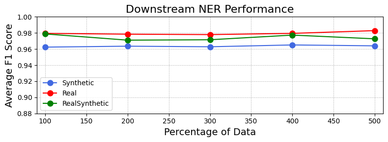

# LT3
LT3 is a novel Conditional Transformer designed for generating synthetic medical instructions as an alternative to real medical data, addressing data privacy restrictions and scracity issues. It has demonstrated better generation quality and diversity than Large Language Models (LLM), and the ability to effectively train NER model with performances comparable to those achieved with real data. On top of that, our research proposes a new Beam Search Decoding algorithm (B2SD) which outperformed state-of-the-art methods on our task.

This work was presented at *NeurIPS 2023's Workshop on Synthetic Data Generation with Generative AI*. 

Our pre-print can be found here: https://arxiv.org/abs/2310.19727.

*Authors: Samuel Belkadi, Nicolo Micheletti, Lifeng Han, Warren Del-Pinto, Goran Nenadic.*

## Setup
This repository is a ready-to-run version of LT3. In order to generate synthetic data, the following requirements must be met:
- Python version: 3.11.7
- Pip verion: 23.3.1

Then, required packages must be installed by running the following command at the root of the reposity:
```pip install -r requirements.txt```

## Usage: Generate data
In order to generate syntethic data, you must follow the steps given below:

1. First, you should download the LT3 model, named `lt3_model.py`, from the follow hugging face page: https://huggingface.co/SamySam0/LT3 . The model must be placed at the root of this repository with the same name.

2. Second, you should create/edit the file named `medications.txt` at the root of the repository. This file may include medication names as well as the number of prescriptions to generate for each medication. Each line must provide a medication name and its number of generations with the form `name:amount` (e.g, `aspirin:5` to get five different prescriptions of aspirin).

3. Then, the file `generate.py` must be called to generate the desired synthetic data. You can call this script using the command ```python3 generate.py``` where the following arguments can be added:
    - -in (--input_path): path to input dictionnary's file (default: './medications.txt');
    - -out (--output_path): path to output file (default: './generations.json');

    - -bs (--beam_size): beam size for beam search decoding (default: 4);
    - -mspd (--max_step_prob_diff): maximal step probability difference for beam search decoding (default: 1.0);
    - -nrpl (--no_repetition_length): minimal length between repeated special characters in generations (default: 4);
    - -a (--alpha): alpha value (hyperparameter) for beam search decoding (default: 0.6);
    - -tlp (--tree_length_product): tree length product for beam search decoding (default: 3);

4. Finally, the generated prescriptions will be available in the desired output file. Note that the number of desired prescriptions may exceed the maximum possible generations if you asked for too many prescriptions and saturated the decoding tree, or have over-restricted the model with your chosen hyperparameters (arguments). In this case, some prescriptions may be given as `-` to signify that they could not be generated.


## Evaluation results

### Lexical Similarity Evaluation against References

The results below show that LT3’s generations are the closest match to the reference samples. We used multi-reference evaluation to consolidate our results. Higher scores are better.

| Models   | BLEU  | ROUGE-1 | ROUGE-2 | ROUGE-L | BERTScore |
|----------|-------|---------|---------|---------|-----------|
| T5 Small | 71.75 | 76.16   | 66.24   | 75.55   | 0.70      |
| T5 Base  | 71.98 | 76.28   | 66.30   | 75.45   | 0.70      |
| T5 Large | 69.89 | 75.07   | 65.19   | 74.22   | 0.68      |
| LT3      | **78.52** | **78.16**   | **68.72**   | **77.55**   | **0.72**      |

### Lexical Diversity Evaluation within Generated Outputs

The results below measure the diversity between models' outputs. For each label, we measured the Jaccard similarity score of the generations of our models. A higher Jaccard Score indicates more similarity between the two populations, while a lower score indicates better diversity in our tasks.

|       | Median Jaccard Score | Average Jaccard Score |
|-------|-----------------------|-----------------------|
| LT3   | **0.650**             | **0.652**             |
| T5 Base | 0.658               | 0.660                 |


### Downstream NER Evaluation

The results below demonstrate the efficiency of our generated synthetic dataset to train an NER model compared to when using real data.



## Thank you
Feel free to use LT3 for any research purpose. 

Please contact us if you have any questions, and **cite our work** whenever used.